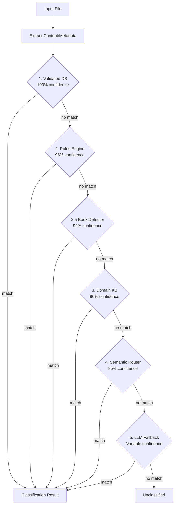

# Developer Onboarding Guide

Complete guide for new contributors to the para-files project.

## Prerequisites

- macOS with Apple Silicon (M1/M2/M3) - **Required**
- Python 3.12+
- [uv](https://docs.astral.sh/uv/) package manager
- Git

## Environment Setup

### Step 1: Clone and Install

```bash
# Clone the repository
git clone https://github.com/fjacquet/para-files.git
cd para-files

# Install all dependencies including dev tools
uv sync --all-extras

# Verify installation
uv run para-files --version
```

### Step 2: Set Up Development Environment

```bash
# Create a test PARA folder structure
mkdir -p /tmp/test-para/{0_Inbox,1_Projects,2_Areas,3_Resources,4_Archives}

# Set environment variable for testing
export PARA_FILES_PARA_ROOT="/tmp/test-para"

# Install pre-commit hooks
pre-commit install
```

### Step 3: Verify Everything Works

```bash
# Run the test suite
uv run pytest -v

# Run linter
uv run ruff check src/ tests/

# Run type checker
uv run mypy src/

# Test CLI
uv run para-files --help
```

## Codebase Structure

```
para-files/
├── src/para_files/           # Main source code
│   ├── __init__.py
│   ├── main.py               # CLI entry point (Typer app)
│   ├── config.py             # Configuration with pydantic-settings
│   ├── pipeline.py           # 6-signal classification orchestrator
│   ├── reference_tree.py     # YAML reference tree loader
│   ├── types.py              # Pydantic data models
│   ├── mover.py              # File move/copy operations
│   ├── classifiers/          # Classification signal implementations
│   │   ├── validated_db.py   # Signal 1: Manual mappings
│   │   ├── rules_engine.py   # Signal 2: Glob patterns
│   │   ├── book_detector.py  # Signal 2.5: Book detection
│   │   ├── domain_kb.py      # Signal 3: Known issuers
│   │   ├── semantic_router.py # Signal 4: MLX embeddings
│   │   └── llm_fallback.py   # Signal 5: LLM fallback
│   ├── encoders/
│   │   └── mlx_encoder.py    # MLX embedding encoder
│   └── utils/                # Utility modules
│       ├── file_utils.py     # File content extraction
│       ├── geolocation.py    # GPS reverse geocoding
│       ├── pdf_metadata.py   # PDF metadata extraction
│       ├── isbn_lookup.py    # ISBN lookup service
│       ├── ocr.py            # Vision Framework OCR
│       ├── exiftool.py       # EXIF extraction
│       ├── pandoc.py         # Document conversion
│       ├── cleanup.py        # Junk file cleanup
│       └── nfo_parser.py     # NFO file parsing
├── tests/                    # Test suite
├── config/
│   └── personal_file_tree.yaml  # PARA reference tree
├── .claude/skills/           # Claude Code skills
├── pyproject.toml            # Project configuration
├── README.md                 # User documentation
├── CLAUDE.md                 # AI assistant instructions
└── CHANGELOG.md              # Version history
```

## Key Files to Understand First

### 1. `src/para_files/types.py` - Data Models

Contains all Pydantic models used throughout:
- `ClassificationResult` - Result of classifying a file
- `ConfidenceLevel` - Confidence and source of classification
- `Route` - A destination route in the PARA structure

### 2. `src/para_files/pipeline.py` - Core Logic

The `ClassificationPipeline` class orchestrates the 6-signal classification:

```python
# Simplified flow
class ClassificationPipeline:
    def classify_file(self, path: Path) -> ClassificationResult:
        # Try each signal in order (first match wins)
        for signal in [validated_db, rules_engine, book_detector,
                       domain_kb, semantic_router, llm_fallback]:
            result = signal.classify(path)
            if result.matched:
                return result
        return ClassificationResult.unclassified()
```

### 3. `src/para_files/main.py` - CLI Commands

All CLI commands are defined here using Typer:
- `classify` - Classify files
- `move` - Classify and move files
- `scan` - Preview directory classifications
- `clean` - Remove junk files
- And more...

### 4. `config/personal_file_tree.yaml` - Reference Tree

Defines the PARA folder structure, routes, and issuers:

```yaml
config:
  para_root: "~/Documents/PARA"
  mlx:
    model_name: "nomic-text-v1.5"
    score_threshold: 0.75

routes:
  - name: factures-energie
    path: 2_Areas/finances/factures/energie
    utterances:
      - "electric bill"
      - "gas invoice"
      - "utility bill"

issuers:
  banques:
    - "UBS"
    - "Credit Suisse"
```

## Development Workflow

### Making Changes

1. **Create a branch**
   ```bash
   git checkout -b feature/my-feature
   ```

2. **Make changes** following code style

3. **Run quality checks**
   ```bash
   uv run ruff check src/ tests/
   uv run ruff format src/ tests/
   uv run mypy src/
   uv run pytest -v
   ```

4. **Update documentation**
   - Add entry to CHANGELOG.md under `[Unreleased]`
   - Update README.md if CLI changes
   - Add docstrings to new public functions

5. **Commit and push**
   ```bash
   git add .
   git commit -m "feat: add my feature"
   git push -u origin feature/my-feature
   ```

### Code Style Rules

| Rule | Enforcement |
|------|-------------|
| Line length: 100 chars | Ruff |
| Type hints required | mypy (strict) |
| `from __future__ import annotations` | All modules |
| Docstrings for public functions | Convention |
| No `print()` - use `logging` | Ruff (T201) |

### Testing Guidelines

- Tests go in `tests/` directory
- Match test file names: `test_<module>.py`
- Use pytest fixtures for common setup
- Mock external services (MLX, filesystem)
- Aim for 80%+ coverage

```python
# Example test
def test_classify_pdf(tmp_path: Path, mock_encoder: MockEncoder):
    """Test PDF classification returns correct route."""
    pdf = tmp_path / "invoice.pdf"
    pdf.write_bytes(b"%PDF-1.4...")

    result = pipeline.classify_file(pdf)

    assert result.category == "2_Areas/finances/factures"
    assert result.confidence.value >= 0.75
```

## Architecture Deep Dive

### The 6-Signal Pipeline



### MLX Embeddings

The semantic router uses MLX for fast local embeddings:

```python
from para_files.encoders import MLXEncoder

# Lazy loading - model downloads on first use
encoder = MLXEncoder(model_name="mlx-community/nomic-embed-text-v1.5")

# Encode text (10-15ms latency)
embeddings = encoder(["invoice from electric company"])

# Compare with cosine similarity
similarity = cosine_similarity(embeddings, route_embeddings)
```

## Debugging Tips

### Enable Verbose Logging

```bash
uv run para-files classify document.pdf -v
```

### Test Specific Routes

```bash
uv run para-files test-route factures-energie --file invoice.pdf -v
```

### Inspect Reference Tree

```bash
uv run para-files tree --validate
uv run para-files routes --utterances
uv run para-files issuers
```

### Check Configuration

```bash
uv run para-files config --show
```

## Common Issues

### Issue: MLX Import Error

```
ImportError: No module named 'mlx'
```

**Solution**: Ensure you're on Apple Silicon Mac. MLX only works on M1/M2/M3.

### Issue: Tests Fail with Missing PARA_ROOT

**Solution**: Set environment variable:
```bash
export PARA_FILES_PARA_ROOT="/tmp/test-para"
```

### Issue: Type Errors

**Solution**: Run mypy and fix annotations:
```bash
uv run mypy src/ --show-error-codes
```

## Getting Help

- Check existing issues on GitHub
- Read the test files for usage examples
- Review CLAUDE.md for conventions
- Ask in discussions/issues
