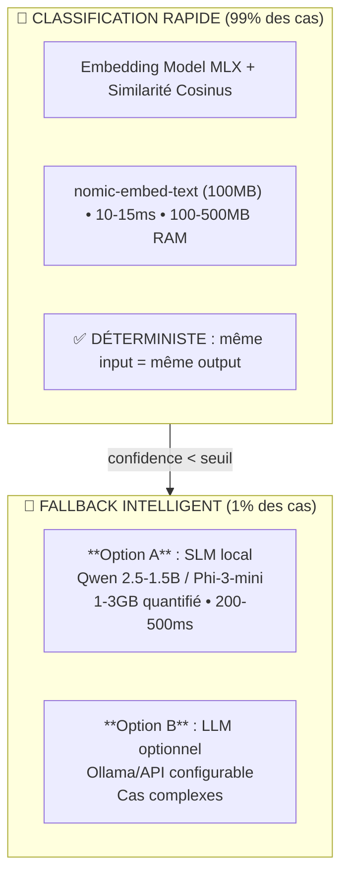
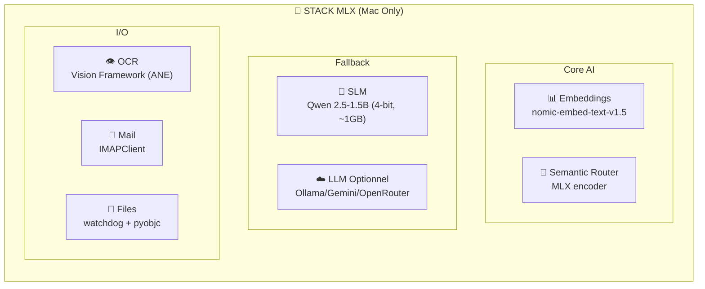
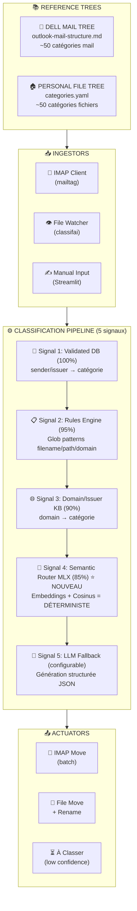

# Plan Unifié : Classification Intelligente Mail & Fichiers

## Décision Clé : SLM vs LLM

### Situation Actuelle (à remplacer)

| Projet    | Solution Actuelle                  | Problème                          |
| --------- | ---------------------------------- | --------------------------------- |
| mailtag   | litellm → Ollama/Gemini/OpenRouter | Dépendance serveur, latence, coût |
| classifai | Ollama (gemma:2b)                  | Serveur local requis, 4-16GB RAM  |

### Options SLM (Small Language Models)

| Option              | Runtime        | Modèles                      | Avantages                                               | Inconvénients              |
| ------------------- | -------------- | ---------------------------- | ------------------------------------------------------- | -------------------------- |
| **ONNX Runtime**    | Cross-platform | mDeBERTa, MiniLM, DistilBERT | Fonctionne partout, bien documenté, quantization facile | Moins optimisé Mac que MLX |
| **MLX**             | macOS only     | Qwen 2.5, Llama 3, Gemma 2   | Performance maximale sur M1-M4, Apple officiel          | macOS uniquement           |
| **llama.cpp**       | Cross-platform | GGUF (Qwen, Llama, Phi)      | Très rapide, communauté active                          | Plus complexe à intégrer   |
| **Transformers.js** | Node/Browser   | ONNX models                  | JavaScript natif                                        | Moins mature pour Python   |

### Recommandation : Architecture Hybride



### DÉCISIONS

| Question      | Choix                                                        |
| ------------- | ------------------------------------------------------------ |
| **Runtime**   | **MLX** (Apple) - Optimisation maximale Mac                  |
| **Fallback**  | **LLM optionnel** - Configurable Ollama/API pour cas ambigus |
| **Référence** | **Deux arbres séparés** - Dell mail ≠ fichiers personnels    |
| **Platform**  | **Mac uniquement** - Autorise MLX, Vision Framework          |

### Stack Technique Finale



---

## Synthèse des Deux Propositions de Collègues

### Document 1 : `251225-onnx-classification-plan.md`

- **Focus** : ONNX Runtime avec mDeBERTa zero-shot multilingue
- **Avantages** : 10-50ms latence, 500MB RAM, pas de serveur
- **Approche** : Remplacer LLM (Ollama/litellm) par ONNX

### Document 2 : `Classification IA locale Mac Fichiers Mails.md`

- **Focus** : MLX + semantic-router pour déterminisme absolu
- **Modèles** : Qwen 2.5 (7B) + Nomic-Embed embeddings
- **Approche** : Routage sémantique vectoriel + génération structurée fallback
- **Problème** : Utilise Apple Mail (.emlx + AppleScript) → **remplacé par IMAP**

---

## Architecture Unifiée Proposée

### Principe Clé : Deux Arbres de Référence Séparés

| Arbre                  | Source                      | Usage                                | Projet    |
| ---------------------- | --------------------------- | ------------------------------------ | --------- |
| **Dell Mail Tree**     | `outlook-mail-structure.md` | Classification emails professionnels | mailtag   |
| **Personal File Tree** | `categories.yaml`           | Classification fichiers personnels   | classifai |

Avantages de la séparation :

1. Taxonomies indépendantes (vocabulaire Dell ≠ vocabulaire personnel)
2. Évolution séparée (mise à jour Dell n'impacte pas fichiers perso)
3. Modèles d'embeddings optimisés par domaine

### Diagramme d'Architecture



---

## Composants Techniques

### 1. Reference Tree Manager

**Fichiers sources** :

- `2_Areas/dell/outlook-mail-structure.md` → Catégories mail Dell
- `config/categories.yaml` (classifai) → Catégories fichiers personnels

**Fonctionnalités** :

```python
class ReferenceTreeManager:
    def load_from_markdown(self, path: str) -> dict[str, list[str]]
    def load_from_yaml(self, path: str) -> list[str]
    def get_all_categories(self) -> list[str]
    def get_hierarchy(self) -> dict  # Parent → [Children]
    def generate_embeddings(self) -> dict[str, np.ndarray]  # Catégorie → Embedding
```

### 2. Semantic Router avec MLX (Signal 4)

**Bibliothèque** : `aurelio-labs/semantic-router` + custom MLX encoder

**Modèle d'embedding MLX** :

- `mlx-community/nomic-embed-text-v1.5` (8K context, multilingue)
- Ou `mlx-community/bge-m3` (excellent pour FR/EN/DE)

**Implémentation MLX** :

```python
import mlx.core as mx
from mlx_embedding import load_model, embed
from semantic_router import Route, SemanticRouter

class MLXEncoder:
    """Encoder personnalisé pour semantic-router avec MLX"""
    def __init__(self, model_name: str = "mlx-community/nomic-embed-text-v1.5"):
        self.model, self.tokenizer = load_model(model_name)

    def __call__(self, texts: list[str]) -> list[list[float]]:
        embeddings = embed(self.model, self.tokenizer, texts)
        return embeddings.tolist()

# Générer routes depuis reference tree
def build_routes_from_tree(tree: dict) -> list[Route]:
    routes = []
    for category, examples in tree.items():
        routes.append(Route(
            name=category,
            utterances=examples  # Noms d'entités = exemples
        ))
    return routes

encoder = MLXEncoder()
dell_router = SemanticRouter(encoder=encoder, routes=build_routes_from_tree(dell_tree))
perso_router = SemanticRouter(encoder=encoder, routes=build_routes_from_tree(perso_tree))

# Classification déterministe
result = dell_router(email_text)  # Retourne Route.name ou None
```

**Avantages MLX** :

- DÉTERMINISTE (même input → même output, toujours)
- Ultra-rapide (~10-15ms sur Apple Silicon)
- Utilise la mémoire unifiée (UMA) - pas de copie GPU
- Pas d'hallucination (catégories prédéfinies uniquement)
- 100% offline

### 3. IMAP Integration (de mailtag)

**Réutilisation** : `/Users/fjacquet/Projects/mailtag/src/mailtag/imap_service.py`

**Adaptations** :

1. Configurer pour Outlook Exchange (Dell) ou Infomaniak (perso)
2. Mapper folders IMAP vers reference tree
3. Sync bidirectionnelle : reference tree ↔ IMAP folders

---

## Fichiers à Créer/Modifier

### Nouveau : Bibliothèque Partagée `classifai-core`

```text
/Users/fjacquet/Projects/classifai-core/
├── src/classifai_core/
│   ├── __init__.py
│   ├── reference_tree.py      # Chargement arborescences (Dell + Perso)
│   ├── semantic_router.py     # Wrapper semantic-router + MLX encoder
│   ├── mlx_encoder.py         # Encoder MLX pour embeddings
│   ├── embeddings.py          # Génération/cache embeddings
│   └── types.py               # Types partagés (Pydantic)
├── config/
│   ├── dell_mail_tree.yaml    # Arborescence Dell (depuis outlook-mail-structure.md)
│   └── personal_file_tree.yaml # Arborescence fichiers perso (depuis categories.yaml)
└── pyproject.toml
```

### Modifications mailtag

| Fichier                     | Modification                              |
| --------------------------- | ----------------------------------------- |
| `pyproject.toml`            | Ajouter dépendance `classifai-core`       |
| `src/mailtag/classifier.py` | Intégrer semantic router comme Signal 4.5 |
| `config.toml`               | Ajouter section `[semantic_router]`       |

### Modifications classifai

| Fichier                     | Modification                                      |
| --------------------------- | ------------------------------------------------- |
| `pyproject.toml`            | Ajouter dépendance `classifai-core`               |
| `src/classifai/pipeline.py` | Intégrer semantic router après rules              |
| `config/`                   | Remplacer categories.yaml par reference_tree.yaml |

---

## Stratégie de Migration

### Phase 1 : Bibliothèque Core MLX

**Objectif** : Créer `classifai-core` avec MLX encoder

1. Initialiser projet Python (`uv init classifai-core`)
2. Implémenter `MLXEncoder` pour semantic-router
3. Parser `outlook-mail-structure.md` → `dell_mail_tree.yaml`
4. Copier `categories.yaml` → `personal_file_tree.yaml`
5. Tests unitaires du semantic router avec les deux arbres
6. Benchmark : mesurer latence sur Mac

### Phase 2 : Intégration mailtag

**Objectif** : Ajouter Signal 4.5 (semantic router MLX)

1. Ajouter dépendance `classifai-core`
2. Créer `_classify_with_semantic_router()` dans classifier.py
3. Insérer entre Domain (Signal 4) et AI (Signal 5)
4. Configurer seuil confidence (0.8 par défaut)
5. Comparer précision sur 500 emails vs AI seul
6. Mesurer réduction appels LLM

### Phase 3 : Intégration classifai

**Objectif** : Remplacer LLM par semantic router quand possible

1. Ajouter dépendance `classifai-core`
2. Insérer étape semantic router dans pipeline (après rules, avant LLM)
3. Tests end-to-end sur corpus fichiers
4. Valider que LLM n'est appelé que pour cas ambigus

### Phase 4 : Optimisation & Documentation

**Objectif** : Peaufiner et documenter

1. Cache LRU pour embeddings fréquents
2. Batch processing pour imports massifs
3. Mettre à jour README des deux projets
4. Créer note dans Second Brain avec architecture finale

---

## Comparaison : Architecture Actuelle vs Proposée

| Aspect                 | Actuel (mailtag) | Actuel (classifai) | Unifié (MLX)                 |
| ---------------------- | ---------------- | ------------------ | ---------------------------- |
| Catégories             | IMAP dynamique   | categories.yaml    | **2 arbres séparés**         |
| Signal rapide          | Domain lookup    | Rules engine       | **Semantic router MLX**      |
| AI fallback            | litellm          | Ollama             | **Optionnel (configurable)** |
| Latence classification | 50-500ms         | 100-500ms          | **10-15ms**                  |
| Déterminisme           | Non (AI)         | Non (AI)           | **Oui (embeddings)**         |
| Mémoire                | 4-16GB (LLM)     | 4-16GB (Ollama)    | **200-500MB (MLX)**          |
| Platform               | Cross-platform   | Cross-platform     | **Mac only (optimisé)**      |

---

## Questions Ouvertes (à valider pendant implémentation)

1. **Granularité** : Classifier jusqu'au niveau le plus fin (`Customers/States/GE/SIG`) ou parent (`Customers/States/GE`) ?

2. **Sync IMAP** : Créer automatiquement les folders IMAP manquants depuis le reference tree ?

3. **Format reference tree** : Parser le markdown `outlook-mail-structure.md` directement ou le convertir en YAML ?

---

## Voir aussi

- [[251225-onnx-classification-plan]] - Proposition initiale ONNX
- [[Classification IA locale Mac Fichiers Mails]] - Proposition MLX/Apple Mail
- [[outlook-mail-structure]] - Structure folders Dell
- [[classifai]] - Projet classification fichiers
- [[mailtag]] - Projet classification mails
