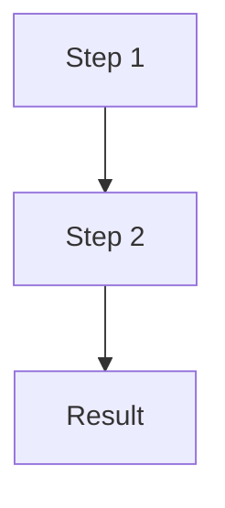

# CLAUDE.md

This file provides guidance to Claude Code (claude.ai/code) when working with code in this repository.

## Project Overview

**para-files** is an intelligent file classification system using Ollama-powered semantic routing (via litellm). It implements the PARA method (Projects, Areas, Resources, Archives) with a deterministic 6-signal classification pipeline. OCR features require macOS (Apple Silicon).

For detailed project information, see the full documentation at [docs/index.md](docs/index.md).

## Build & Development Commands

```bash
# Makefile shortcuts (one-shot alternatives)
make fix           # Auto-fix ruff issues + format in one step
make quality       # Lint + typecheck only (skip tests)
make test-cov      # Tests with missing-line coverage report
make clean         # Remove .pytest_cache, .mypy_cache, dist, etc.
make all           # Full pipeline: setup, lint, format, typecheck, test

# Install dependencies (includes dev tools)
uv sync --all-extras

# Run the application
uv run para-files --help

# Run all quality checks
uv run ruff check src/ tests/      # Lint
uv run ruff format src/ tests/     # Format
uv run mypy src/                   # Type check

# Testing
uv run pytest                      # Run all tests
uv run pytest -v                   # Verbose output
uv run pytest tests/test_main.py   # Single test file
uv run pytest -k "test_version"    # Run tests matching pattern
uv run pytest --cov                # With coverage report

# Pre-commit hooks (after install)
pre-commit install                 # Install hooks
pre-commit run --all-files         # Run manually
```

## Development Principles

- **KISS** - Keep It Simple, Stupid. Prefer simple solutions over complex ones.
- **DRY** - Don't Repeat Yourself. Extract common patterns into reusable functions.
- **YAGNI** - You Aren't Gonna Need It. Don't add features "just in case".
- **Don't reinvent the wheel** - Use established libraries (loguru, pydantic, etc.).
- **Functional programming** - Prefer pure functions, avoid side effects, use immutable data.

## Code Style

- **Python 3.12+** with strict mypy
- **Ruff** for linting and formatting
- **Line length**: 100 characters
- **Future imports**: `from __future__ import annotations` in all modules
- **Type hints**: Comprehensive typing throughout
- **Package**: Marked as typed (`py.typed` marker present)
- **Logging**: Use `from loguru import logger` (not standard logging)

## Key Files

| File | Purpose |
|------|---------|
| `src/para_files/main.py` | CLI entry point (re-exports; commands live in `cli/`) |
| `src/para_files/cli/` | All CLI commands (scan, move, classify, bookstore, learn, routes, etc.) |
| `src/para_files/config.py` | Configuration management |
| `src/para_files/pipeline.py` | 6-signal classification orchestrator |
| `src/para_files/types.py` | Domain type definitions |
| `src/para_files/mover.py` | File move orchestration |
| `src/para_files/learner.py` | Feedback-based learning |
| `src/para_files/reference_tree.py` | YAML reference tree loader |
| `src/para_files/classifiers/` | Classification signal implementations |
| `src/para_files/encoders/ollama_encoder.py` | Ollama embedding encoder via litellm |
| `src/para_files/utils/filename_sanitizer.py` | Centralized filename sanitization |
| `src/para_files/taxonomies/models.py` | Thema/document taxonomy models and path builders |
| `tests/` | Test suite |
| `config/personal_file_tree.yaml` | PARA reference tree (example) |
| `config/thema.json` | Thema v1.6 book classification (9,187 codes) |
| `config/documents.json` | Document type taxonomy for classification |

## Filename Sanitization

**All paths and filenames must be filesystem-safe.** Use centralized utilities:

```python
from para_files.utils.filename_sanitizer import sanitize_filename, sanitize_path_component

# For filenames (replaces invalid chars with _)
sanitize_filename("Hello: World#1")  # → "Hello_World_1"

# For path components (preserves spaces, replaces & with 'et')
sanitize_path_component("Arts : généralités")  # → "Arts - généralités"
```

**Invalid characters handled:** `, # " * : < > ? / \ |`

## Thema Book Classification

Books use **hybrid naming**: `{CodeValue}_{ShortName}`

```python
from para_files.taxonomies.models import ThemaTaxonomy

taxonomy.build_para_path("UB")
# → "3_Resources/livres/U_Informatique/UB_Programmation"
```

**Path format:** `3_Resources/livres/{L1_Code_ShortName}/{L2_Code_ShortName}`

- Max 2 hierarchy levels after `livres/`
- Accents removed (é→e, ç→c)
- Descriptions shortened and sanitized

## Architecture

### Classification Pipeline (v2.2)

Files are classified using a cascade — first match wins. Actual init order in `pipeline.py`:

1. **Book Detector** (96%, 100% with ISBN) - PDF book detection via ISBN/metadata/Thema
2. **Rules Engine** (95%) - Glob patterns on filename/path from `personal_file_tree.yaml`
3. **Taxonomy Classifier** (90%) - Issuers + keywords from `config/documents.json`
4. **Semantic Classifier** (85%) - Ollama embedding similarity (via litellm)
5. **Extension Router** (97%) - Deterministic routing by file extension (catch-all)
6. **LLM Fallback** (60%) - Optional Ollama LLM via litellm

If nothing matches, files go to `0_Inbox`.

## Key Technologies

- **litellm** - Unified LLM/embedding API (calls Ollama, OpenAI, etc.)
- **Ollama** - Local LLM and embedding server (nomic-embed-text, ministral-3:8b)
- **Pydantic** - Configuration and data validation
- **Typer** - CLI framework (built on Click)
- **YAML** - Configuration format
- **Pytest** - Testing framework

## Platform Constraint

OCR features require **macOS** (Apple Silicon) because Vision Framework is macOS-only.
The core classification pipeline (embeddings, LLM, rules, taxonomy) is cross-platform
and only requires a running Ollama server.

## Documentation

All user-facing documentation is in the `docs/` directory:

- **[Getting Started](docs/getting-started/)** - Installation and quick start
- **[CLI Reference](docs/cli/)** - Complete command reference
- **[Configuration](docs/configuration/)** - All configuration options
- **[Tasks](docs/tasks/)** - How-to guides for common workflows
- **[Architecture](docs/architecture/)** - Technical deep dives
- **[Troubleshooting](docs/troubleshooting/)** - Common issues and solutions

**Important**: Keep documentation in sync with code changes. Update `docs/` when making changes, especially for:

- New CLI commands
- Configuration changes
- Architecture modifications
- New features

## Documentation Maintenance

**Always update documentation when making changes:**

| Change Type | Update |
|-------------|--------|
| New feature/command | `CHANGELOG.md` (Unreleased), relevant doc page |
| Bug fix | `CHANGELOG.md` (Unreleased) |
| Architecture change | `docs/architecture/`, `CHANGELOG.md` |
| Config change | `docs/configuration/`, `CHANGELOG.md` |
| Breaking change | `CHANGELOG.md` with migration notes |

Before committing:

1. Update `CHANGELOG.md` under `[Unreleased]`
2. Update relevant doc pages in `docs/`
3. Add docstrings for new public functions

## Documentation Preferences

### Diagrams: Use Mermaid

**Never use ASCII box art** - always use **Mermaid diagrams**:



ASCII boxes are fragile across renderers. Mermaid renders consistently.

### Document Structure

- **One topic per file** - Keep pages focused and scannable
- **Use headers** - Clear hierarchy
- **Include examples** - Code examples are essential
- **Link between docs** - Cross-reference related pages
- **Tables over prose** - Use tables for reference material

## Configuration via Environment Variables

All config uses `pydantic-settings` with `.env` file support:

| Prefix | Config class | Examples |
|--------|-------------|----------|
| `PARA_FILES_MLX_` | `MLXConfig` | `MODEL_NAME`, `SCORE_THRESHOLD`, `SEMANTIC_ENABLED` |
| `PARA_FILES_LLM_` | `LLMConfig` | `ENABLED`, `MODEL`, `CONFIDENCE_THRESHOLD`, `API_BASE` |
| `PARA_FILES_LOG_` | `LoggingConfig` | `LEVEL`, `ROTATION`, `RETENTION` |

Priority: env vars > `.env` file > YAML `config:` section > defaults.

## CLI Module Pattern

Commands live in `src/para_files/cli/`. Each `*_cmd.py` imports `app` from `cli/app.py` and registers via `@app.command()`. `main.py` imports all command modules to trigger registration, then re-exports symbols for backward compatibility with tests.

To add a new CLI command:
1. Create `src/para_files/cli/yourcommand_cmd.py` with `@app.command()` (Typer, not Click)
2. Import the module in `main.py`
3. Add tests in `tests/test_yourcommand_cmd.py`

## Performance Notes

- Pipeline initializes lazily on first classification (thread-safe via `threading.Lock`)
- Reference tree loaded once at startup
- Embeddings calculated per-request (not cached)
- Ollama server must be running for semantic/LLM signals

<!-- rtk-instructions v2 -->
# RTK (Rust Token Killer) - Token-Optimized Commands

## Golden Rule

**Always prefix commands with `rtk`**. If RTK has a dedicated filter, it uses it. If not, it passes through unchanged. This means RTK is always safe to use.

**Important**: Even in command chains with `&&`, use `rtk`:
```bash
# ❌ Wrong
git add . && git commit -m "msg" && git push

# ✅ Correct
rtk git add . && rtk git commit -m "msg" && rtk git push
```

## RTK Commands by Workflow

### Build & Compile (80-90% savings)
```bash
rtk cargo build         # Cargo build output
rtk cargo check         # Cargo check output
rtk cargo clippy        # Clippy warnings grouped by file (80%)
rtk tsc                 # TypeScript errors grouped by file/code (83%)
rtk lint                # ESLint/Biome violations grouped (84%)
rtk prettier --check    # Files needing format only (70%)
rtk next build          # Next.js build with route metrics (87%)
```

### Test (90-99% savings)
```bash
rtk cargo test          # Cargo test failures only (90%)
rtk vitest run          # Vitest failures only (99.5%)
rtk playwright test     # Playwright failures only (94%)
rtk test <cmd>          # Generic test wrapper - failures only
```

### Git (59-80% savings)
```bash
rtk git status          # Compact status
rtk git log             # Compact log (works with all git flags)
rtk git diff            # Compact diff (80%)
rtk git show            # Compact show (80%)
rtk git add             # Ultra-compact confirmations (59%)
rtk git commit          # Ultra-compact confirmations (59%)
rtk git push            # Ultra-compact confirmations
rtk git pull            # Ultra-compact confirmations
rtk git branch          # Compact branch list
rtk git fetch           # Compact fetch
rtk git stash           # Compact stash
rtk git worktree        # Compact worktree
```

Note: Git passthrough works for ALL subcommands, even those not explicitly listed.

### GitHub (26-87% savings)
```bash
rtk gh pr view <num>    # Compact PR view (87%)
rtk gh pr checks        # Compact PR checks (79%)
rtk gh run list         # Compact workflow runs (82%)
rtk gh issue list       # Compact issue list (80%)
rtk gh api              # Compact API responses (26%)
```

### JavaScript/TypeScript Tooling (70-90% savings)
```bash
rtk pnpm list           # Compact dependency tree (70%)
rtk pnpm outdated       # Compact outdated packages (80%)
rtk pnpm install        # Compact install output (90%)
rtk npm run <script>    # Compact npm script output
rtk npx <cmd>           # Compact npx command output
rtk prisma              # Prisma without ASCII art (88%)
```

### Files & Search (60-75% savings)
```bash
rtk ls <path>           # Tree format, compact (65%)
rtk read <file>         # Code reading with filtering (60%)
rtk grep <pattern>      # Search grouped by file (75%)
rtk find <pattern>      # Find grouped by directory (70%)
```

### Analysis & Debug (70-90% savings)
```bash
rtk err <cmd>           # Filter errors only from any command
rtk log <file>          # Deduplicated logs with counts
rtk json <file>         # JSON structure without values
rtk deps                # Dependency overview
rtk env                 # Environment variables compact
rtk summary <cmd>       # Smart summary of command output
rtk diff                # Ultra-compact diffs
```

### Infrastructure (85% savings)
```bash
rtk docker ps           # Compact container list
rtk docker images       # Compact image list
rtk docker logs <c>     # Deduplicated logs
rtk kubectl get         # Compact resource list
rtk kubectl logs        # Deduplicated pod logs
```

### Network (65-70% savings)
```bash
rtk curl <url>          # Compact HTTP responses (70%)
rtk wget <url>          # Compact download output (65%)
```

### Meta Commands
```bash
rtk gain                # View token savings statistics
rtk gain --history      # View command history with savings
rtk discover            # Analyze Claude Code sessions for missed RTK usage
rtk proxy <cmd>         # Run command without filtering (for debugging)
rtk init                # Add RTK instructions to CLAUDE.md
rtk init --global       # Add RTK to ~/.claude/CLAUDE.md
```

## Token Savings Overview

| Category | Commands | Typical Savings |
|----------|----------|-----------------|
| Tests | vitest, playwright, cargo test | 90-99% |
| Build | next, tsc, lint, prettier | 70-87% |
| Git | status, log, diff, add, commit | 59-80% |
| GitHub | gh pr, gh run, gh issue | 26-87% |
| Package Managers | pnpm, npm, npx | 70-90% |
| Files | ls, read, grep, find | 60-75% |
| Infrastructure | docker, kubectl | 85% |
| Network | curl, wget | 65-70% |

Overall average: **60-90% token reduction** on common development operations.
<!-- /rtk-instructions -->