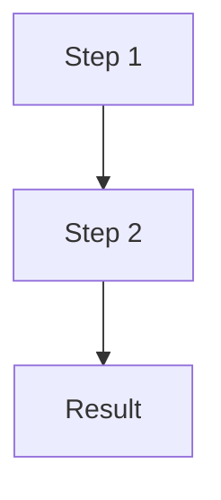

# CLAUDE.md

Development guidance for Claude Code (claude.ai/code) when working with this repository.

## Project Overview

**para-files** is a macOS-only (Apple Silicon) intelligent file classification system using MLX-powered semantic routing. It implements the PARA method (Projects, Areas, Resources, Archives) with a deterministic 6-signal classification pipeline.

For detailed project information, see the full documentation at [docs/index.md](docs/index.md).

## Build & Development Commands

```bash
# Install dependencies (includes dev tools)
uv sync --all-extras

# Run the application
uv run para-files --help

# Run all quality checks
uv run ruff check src/ tests/      # Lint
uv run ruff format src/ tests/     # Format
uv run mypy src/                   # Type check

# Testing
uv run pytest                      # Run all tests
uv run pytest -v                   # Verbose output
uv run pytest tests/test_main.py   # Single test file
uv run pytest -k "test_version"    # Run tests matching pattern
uv run pytest --cov                # With coverage report

# Pre-commit hooks (after install)
pre-commit install                 # Install hooks
pre-commit run --all-files         # Run manually
```

## Code Style

- **Python 3.12+** with strict mypy
- **Ruff** for linting and formatting
- **Line length**: 100 characters
- **Future imports**: `from __future__ import annotations` in all modules
- **Type hints**: Comprehensive typing throughout
- **Package**: Marked as typed (`py.typed` marker present)

## Key Files

| File | Purpose |
|------|---------|
| `src/para_files/main.py` | CLI entry point |
| `src/para_files/config.py` | Configuration management |
| `src/para_files/pipeline.py` | 6-signal classification orchestrator |
| `src/para_files/reference_tree.py` | YAML reference tree loader |
| `src/para_files/classifiers/` | Classification signal implementations |
| `src/para_files/encoders/mlx_encoder.py` | MLX embedding encoder with lazy loading |
| `src/para_files/utils/filename_sanitizer.py` | Centralized filename sanitization |
| `src/para_files/taxonomies/models.py` | Thema/document taxonomy models and path builders |
| `tests/` | Test suite |
| `config/personal_file_tree.yaml` | PARA reference tree (example) |
| `config/thema.json` | Thema v1.6 book classification (9,187 codes) |

## Filename Sanitization

**All paths and filenames must be filesystem-safe.** Use centralized utilities:

```python
from para_files.utils.filename_sanitizer import sanitize_filename, sanitize_path_component

# For filenames (replaces invalid chars with _)
sanitize_filename("Hello: World#1")  # → "Hello_World_1"

# For path components (preserves spaces, replaces & with 'et')
sanitize_path_component("Arts : généralités")  # → "Arts - généralités"
```

**Invalid characters handled:** `, # " * : < > ? / \ |`

## Thema Book Classification

Books use **hybrid naming**: `{CodeValue}_{ShortName}`

```python
from para_files.taxonomies.models import ThemaTaxonomy

taxonomy.build_para_path("UB")
# → "3_Resources/livres/U_Informatique/UB_Programmation"
```

**Path format:** `3_Resources/livres/{L1_Code_ShortName}/{L2_Code_ShortName}`

- Max 2 hierarchy levels after `livres/`
- Accents removed (é→e, ç→c)
- Descriptions shortened and sanitized

## Architecture

### 6-Signal Classification Pipeline

Files are classified using signals in priority order:

1. **Validated DB** (100%) - Manual mappings from user feedback
2. **Rules Engine** (95%) - Glob patterns on filename/path
3. **Book Detector** (92%) - PDF book detection via ISBN/metadata
4. **Domain KB** (90%) - Known issuer to category mappings
5. **Semantic Router** (85%) - MLX embedding similarity
6. **LLM Fallback** (configurable) - Optional AI classification

For detailed architecture, see [docs/architecture/overview.md](docs/architecture/overview.md).

## Key Technologies

- **MLX** - Optimized embeddings on Apple Neural Engine
- **Pydantic** - Configuration and data validation
- **Click** - CLI framework
- **YAML** - Configuration format
- **Pytest** - Testing framework

## Platform Constraint

This project is **macOS only** (Apple Silicon required) because:

- MLX requires Apple Neural Engine
- Vision Framework for OCR is macOS-only

## Documentation

All user-facing documentation is in the `docs/` directory:

- **[Getting Started](docs/getting-started/)** - Installation and quick start
- **[CLI Reference](docs/cli/)** - Complete command reference
- **[Configuration](docs/configuration/)** - All configuration options
- **[Tasks](docs/tasks/)** - How-to guides for common workflows
- **[Architecture](docs/architecture/)** - Technical deep dives
- **[Troubleshooting](docs/troubleshooting/)** - Common issues and solutions

**Important**: Keep documentation in sync with code changes. Update `docs/` when making changes, especially for:

- New CLI commands
- Configuration changes
- Architecture modifications
- New features

## Documentation Maintenance

**Always update documentation when making changes:**

| Change Type | Update |
|-------------|--------|
| New feature/command | `CHANGELOG.md` (Unreleased), relevant doc page |
| Bug fix | `CHANGELOG.md` (Unreleased) |
| Architecture change | `docs/architecture/`, `CHANGELOG.md` |
| Config change | `docs/configuration/`, `CHANGELOG.md` |
| Breaking change | `CHANGELOG.md` with migration notes |

Before committing:

1. Update `CHANGELOG.md` under `[Unreleased]`
2. Update relevant doc pages in `docs/`
3. Add docstrings for new public functions

## Documentation Preferences

### Diagrams: Use Mermaid

**Never use ASCII box art** - always use **Mermaid diagrams**:



ASCII boxes are fragile across renderers. Mermaid renders consistently.

### Document Structure

- **One topic per file** - Keep pages focused and scannable
- **Use headers** - Clear hierarchy
- **Include examples** - Code examples are essential
- **Link between docs** - Cross-reference related pages
- **Tables over prose** - Use tables for reference material

## Testing

```bash
# Run all tests
uv run pytest

# With coverage
uv run pytest --cov=src/para_files

# Specific test file
uv run pytest tests/test_classifiers.py

# Specific test
uv run pytest tests/test_classifiers.py::test_semantic_router
```

## Development Workflow

1. Create feature branch
2. Write tests first (TDD)
3. Implement feature
4. Run all checks (`ruff check/format`, `mypy`, `pytest`)
5. Update documentation
6. Create pull request

## Common Tasks

### Add a New CLI Command

1. Add command function in `main.py`
2. Add Click decorators for arguments/options
3. Create command documentation page in `docs/cli/`
4. Update `docs/cli/overview.md`
5. Add tests in `tests/test_main.py`
6. Update `CHANGELOG.md`

### Add Configuration Option

1. Add to `ConfigSettings` in `config.py`
2. Document in `docs/configuration/`
3. Update example `.env` file
4. Add tests
5. Update `CHANGELOG.md`

### Add Classification Signal

1. Create file in `src/para_files/classifiers/`
2. Implement signal class
3. Add to pipeline in `pipeline.py`
4. Add tests
5. Document in `docs/architecture/`
6. Update pipeline diagram in docs

## Troubleshooting Development

**Type errors after changes?**

```bash
uv run mypy src/ --show-error-codes
```

**Formatting issues?**

```bash
uv run ruff format src/ tests/
```

**Import errors?**

```bash
# Reinstall in dev mode
uv sync --all-extras
```

**Tests failing?**

```bash
# Run with verbose output
uv run pytest -vv tests/
```

## Performance Considerations

- MLX model loads lazily (first call only)
- Model cached in `~/.cache/huggingface/`
- Embeddings are calculated per-request (not cached)
- Reference tree is loaded once at startup

## Security Notes

- Validates all file paths before operations
- Doesn't execute arbitrary code from YAML
- No automatic deletion without explicit confirmation
- Proper error handling for permission issues

## Related Documents

- **[README.md](README.md)** - User-facing project overview
- **[CONTRIBUTING.md](CONTRIBUTING.md)** - Contribution guidelines
- **[CHANGELOG.md](CHANGELOG.md)** - Version history
- **[docs/](docs/)** - Complete user documentation

## Claude Code Best Practices

### Context is Everything

Provide maximum context for best results:

- Use **planning mode** before complex tasks
- Reference sub-folder CLAUDE.md files for detailed context
- Use `/add-dir` to include relevant directories
- Keep context fresh with sub-agents for summarization

### Available MCPs

| MCP | Purpose |
|-----|---------|
| **Context7** | Documentation lookup for libraries |
| **Serena** | Semantic code navigation and analysis |
| **GitHub** | Repository operations via `gh` CLI |

### When to Use Claude Code

**Best for:**
- Multi-step processes and complex refactors
- Exploring/ramping up on codebases
- Generating files requiring info from many sources
- Running tests with feedback loops

**Less ideal for:**
- Single-line fixes (use direct editing)
- One-step tasks in specific files

### Effective Prompting

1. **Plan first** - Use `/plan` or think through steps
2. **Be specific** - Include file paths, function names, expected behavior
3. **Provide examples** - Show good/bad outputs when relevant
4. **Set acceptance criteria** - Define what "done" looks like

### Sub-agents and Parallel Work

- Use `git worktree` for parallel Claude Code instances on different branches
- Spawn sub-agents for independent tasks
- Let sub-agents summarize large contexts

### Resources

- [Claude Code Best Practices](https://www.anthropic.com/engineering/claude-code-best-practices)
- [Mastering Claude Code (Video)](https://www.youtube.com/watch?v=6eBSHbLKuN0)
- [Claude Code Commands Directory](https://claudecodecommands.directory)
