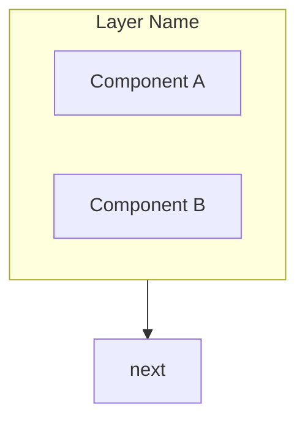

# CLAUDE.md

This file provides guidance to Claude Code (claude.ai/code) when working with code in this repository.

## Project Overview

**para-files** is a macOS-only (Apple Silicon) intelligent file classification system using MLX-powered semantic routing. It implements the PARA method (Projects, Areas, Resources, Archives) with a deterministic embedding-based classification pipeline.

## Build & Development Commands

```bash
# Install dependencies (includes dev tools)
uv sync --all-extras

# Run the application
uv run para-files

# Run all quality checks
uv run ruff check src/ tests/      # Lint
uv run ruff format src/ tests/     # Format
uv run mypy src/                   # Type check

# Testing
uv run pytest                      # Run all tests
uv run pytest -v                   # Verbose output
uv run pytest tests/test_main.py   # Single test file
uv run pytest -k "test_version"    # Run tests matching pattern
uv run pytest --cov                # With coverage report

# Pre-commit hooks (after install)
pre-commit install                 # Install hooks
pre-commit run --all-files         # Run manually
```

## CLI Commands Reference

| Command                           | Description                                                                                                   |
| --------------------------------- | ------------------------------------------------------------------------------------------------------------- |
| `classify <files...>`             | Classify one or more files (supports `--json`, `-v`)                                                          |
| `move <files...>`                 | Classify and move files to PARA destinations (`--dry-run`, `--copy`, `--conflict`, `--skip-unclassifiable`)  |
| `scan <dir>`                      | Preview classifications for directory (`--recursive`, `--ext`, `--json`)                                      |
| `clean <dir>`                     | Remove junk files (.DS_Store, etc.), empty dirs, optionally .nfo files (`--dry-run`, `--nfo`, `--log`)       |
| `init [dest]`                     | Pre-create PARA folder structure (`--subfolders`, `--dry-run`). Note: `move` auto-creates folders             |
| `tree`                            | Display/validate reference tree (`--validate`, `--issuers`, `--rules`)                                        |
| `routes`                          | List available routes (`--utterances`)                                                                        |
| `issuers`                         | List known issuers by category                                                                                |
| `add-issuer <name> -c <category>` | Add issuer to reference tree                                                                                  |
| `add-utterance <route> <text>`    | Add utterance to route                                                                                        |
| `learn <file>`                    | Interactive classification learning from a file                                                               |
| `test-route <route>`              | Test route configuration and optionally match a file (`--file`)                                               |
| `config`                          | Show configuration (`--show`, `--path`)                                                                       |

All commands support `-r/--reference-tree` to specify a custom YAML file.
Configuration is set via the `config:` section in YAML, env vars, or `.env` file.

## Architecture

### 5-Signal Classification Pipeline

The system classifies files using signals in priority order:

1. **Validated DB** (100% confidence) - Manual sender/issuer → category mappings
2. **Rules Engine** (95%) - Glob patterns on filename/path/sender domain
3. **Domain/Issuer KB** (90%) - Known domain/issuer to category mappings
4. **Semantic Router MLX** (85%) - Embedding similarity to reference categories (deterministic)
5. **LLM Fallback** (configurable) - Optional AI for ambiguous cases

### Two Separate Reference Trees

The project maintains distinct taxonomies that should never be mixed:

- **Dell Mail Tree** - Professional email classification (from `outlook-mail-structure.md`)
- **Personal File Tree** - Personal files using PARA structure (`config/personal_file_tree.yaml`)

### MLX Stack

- **Embeddings**: `nomic-embed-text-v1.5` via `mlx-community` (~100MB, 10-15ms latency)
- **Semantic Router**: Custom implementation with cosine similarity
- **SLM Fallback**: Optional Qwen 2.5-1.5B-Instruct via litellm/Ollama
- **OCR**: Vision Framework (Apple Neural Engine)

### Model Loading

The MLX embedding model uses **lazy loading** - it downloads automatically from Hugging Face on first use:

```python
from para_files.encoders import MLXEncoder

# Model not loaded yet (fast instantiation)
encoder = MLXEncoder(model_name="mlx-community/nomic-embed-text-v1.5")

# Model loads on first call (~100MB download, cached in ~/.cache/huggingface)
embeddings = encoder(["text to embed"])
```

The `ClassificationPipeline` handles this automatically - no manual model management needed.

## Configuration

Configuration is loaded from (in priority order):

1. Environment variables (prefix: `PARA_FILES_`)
2. `.env` file
3. `config:` section in `personal_file_tree.yaml`
4. Default values

```yaml
# In personal_file_tree.yaml
config:
  para_root: "~/Documents/PARA"
  mlx:
    model_name: "nomic-text-v1.5"
    score_threshold: 0.75
  llm:
    enabled: false
```

Override via environment: `PARA_FILES_PARA_ROOT=/custom/path`

## Key Files

| File                                     | Purpose                                                             |
| ---------------------------------------- | ------------------------------------------------------------------- |
| `personal_file_tree.yaml`                | PARA structure, routes, issuers, AND app config (`config:` section) |
| `.env.example`                           | Configuration template with all available options                   |
| `src/para_files/config.py`               | Configuration management with pydantic-settings                     |
| `src/para_files/pipeline.py`             | 5-signal classification orchestrator                                |
| `src/para_files/encoders/mlx_encoder.py` | MLX embedding encoder with lazy loading                             |
| `src/para_files/reference_tree.py`       | YAML reference tree loader                                          |
| `src/para_files/classifiers/`            | Classification signal implementations                               |

## Code Style

- Python 3.12+, strict mypy, comprehensive ruff ruleset
- Line length: 100 characters
- Use `from __future__ import annotations` in all modules
- Package is typed (`py.typed` marker present)

## Platform Constraint

This project is **macOS only** (Apple Silicon required) because it uses:

- MLX for optimized embeddings on Apple Neural Engine
- Vision Framework for OCR

## Documentation Maintenance

**Always update documentation when making changes:**

| Change Type | Update |
|-------------|--------|
| New feature/command | `CHANGELOG.md` (Unreleased), `README.md` |
| Bug fix | `CHANGELOG.md` (Unreleased) |
| Architecture change | `CHANGELOG.md`, `docs/architecture.md` |
| Config change | `CHANGELOG.md`, `README.md` (Configuration section) |
| Breaking change | `CHANGELOG.md` with migration notes |

Before committing, verify:
1. `CHANGELOG.md` has entry under `[Unreleased]`
2. README reflects any new CLI options
3. Docstrings added for new public functions

## Documentation Preferences

### Diagrams: Always Use Mermaid

**NEVER use ASCII box art** in markdown files. Always use **Mermaid diagrams** instead:

- ASCII boxes are fragile and break with different fonts/renderers
- Mermaid renders consistently across GitHub, Obsidian, VS Code

**For architecture/flow diagrams:**



**For simple component lists:** Use markdown tables instead of ASCII boxes.
