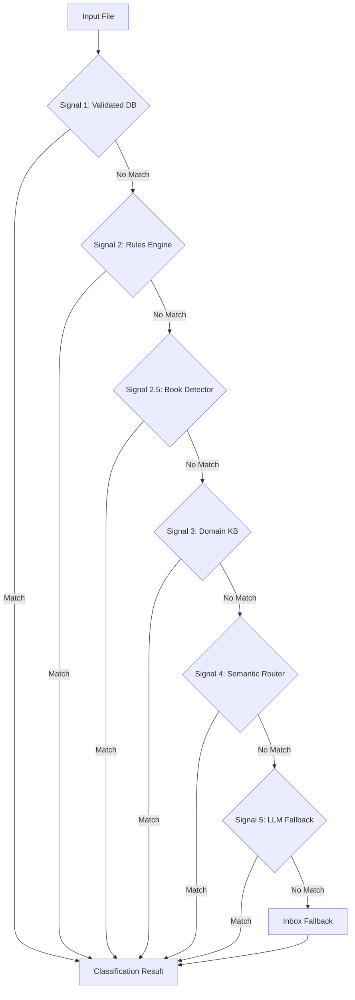
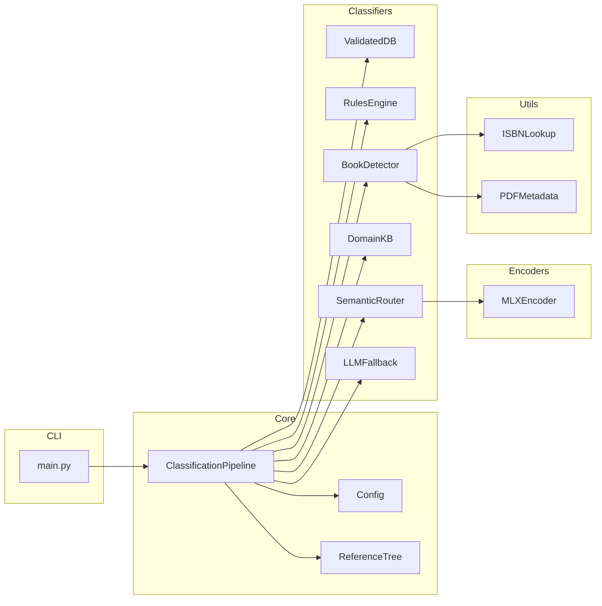
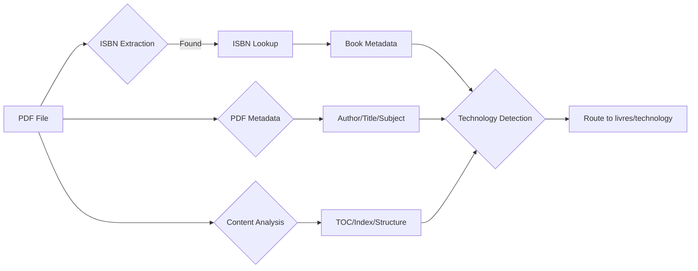

# Architecture

para-files uses a **6-signal classification pipeline** where each signal is tried in priority order. The first classifier that returns a confident result wins.

## Pipeline Overview



## Classification Signals

| Signal | Confidence | Description |
|--------|------------|-------------|
| **1. Validated DB** | 100% | Manual sender/issuer → category mappings from user feedback |
| **2. Rules Engine** | 95% | Glob patterns on filename, path, or sender domain |
| **2.5 Book Detector** | 92% | PDF book detection via ISBN lookup, metadata, and content structure |
| **3. Domain KB** | 90% | Known domain/issuer to category mappings from reference tree |
| **4. Semantic Router** | 85% | MLX embedding similarity to reference category utterances |
| **5. LLM Fallback** | Configurable | Optional AI classification for ambiguous cases |

## Component Architecture



## MLX Stack

- **Embedding Model**: `nomic-embed-text-v1.5` (768 dimensions, 8192 token context)
- **Library**: `mlx-embedding-models` for Apple Silicon optimization
- **Semantic Router**: `aurelio-labs/semantic-router` with custom MLX encoder
- **LLM Fallback**: Optional Qwen 2.5-1.5B via Ollama (requires separate setup)

## Book Detector

The Book Detector (Signal 2.5) identifies technical books in PDF format using a multi-signal approach:



### Detection Signals

| Signal | Weight | Description |
|--------|--------|-------------|
| **ISBN Lookup** | Highest | ISBN found and confirmed via Google Books/Open Library |
| **PDF Metadata** | High | Author, title, subject fields indicate book format |
| **Content Structure** | Medium | Table of contents, chapter markers, index patterns |
| **File Size** | Low | Books typically >1MB |

### Technology Categorization

Detected technologies are mapped to subdirectories:

- `3_Resources/livres/python/` - Python books
- `3_Resources/livres/kubernetes/` - K8s/container books
- `3_Resources/livres/cloud/` - AWS, Azure, GCP books
- And 16+ other technology categories

## Reference Tree Structure

The `personal_file_tree.yaml` defines:

```yaml
config:
  para_root: "~/Documents/PARA"
  mlx:
    model_name: "nomic-text-v1.5"
    score_threshold: 0.75

routes:
  - name: factures-cloud
    path: 4_Archives/factures/{year}/_Cloud/{issuer}
    utterances:
      - "Netflix subscription invoice"
      - "Cloud storage billing"

issuers:
  banques:
    - "UBS Switzerland"
    - "Credit Suisse"
```

## Data Flow

1. **File Input**: User provides file path(s) to classify
2. **Metadata Extraction**: Filename, extension, dates, content preview
3. **Pipeline Cascade**: Each classifier tries to match in priority order
4. **Result**: Category path, confidence score, source classifier
5. **Action**: Move/copy file to PARA destination folder
