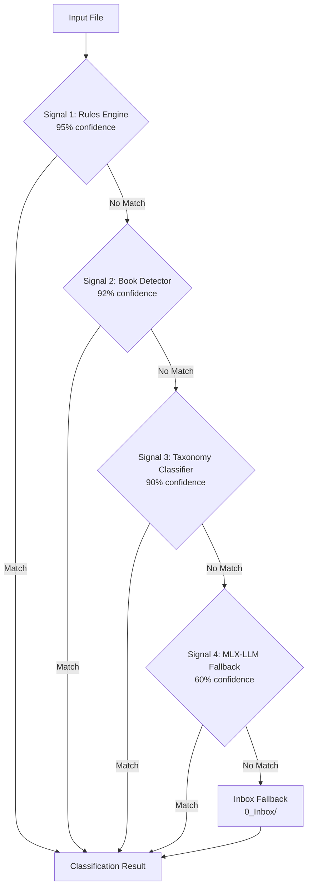
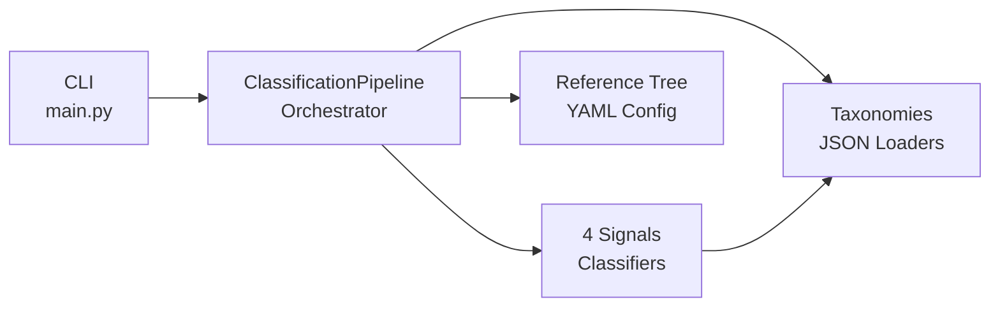

# Architecture Overview

Understanding how para-files classifies documents.

## The 4-Signal Pipeline (v2.0)

Para-files tries 4 classification signals in order. The first confident match wins.



## Signal Details (v2.0)

| Signal | Confidence | What It Does | Data Source |
|--------|-----------|-------------|-------------|
| **1. Rules Engine** | 95% | Matches extensions/patterns | `personal_file_tree.yaml` |
| **2. Book Detector** | 92% | Detects books via ISBN + Thema | `thema.json` hierarchy |
| **3. Taxonomy Classifier** | 90% | Matches keywords + issuers | `documents.json` |
| **4. MLX-LLM Fallback** | 60% | Native MLX-LM inference | In-process (no Ollama) |

### Removed in v2.0

| Signal | Replaced By |
|--------|-------------|
| Validated DB | Taxonomy Classifier (issuers) |
| Domain KB | Taxonomy Classifier (issuers) |
| Semantic Router | Taxonomy Classifier (keywords) |
| LLM Fallback (Ollama) | MLX-LLM Fallback (native) |

## How to Improve Matching

Choose based on your situation:

- **Photo/video routing** → Add extension patterns to `personal_file_tree.yaml`
- **From known companies** → Add issuer to `documents.json`
- **Document type detection** → Add keywords to `documents.json`
- **Technical books** → Automatic via ISBN lookup + Thema classification

### Book Path Format (Thema Hybrid Naming)

Books use the **THEMA v1.6** international classification with hybrid naming:

```
3_Resources/livres/{L1_Code}_{ShortName}/{L2_Code}_{ShortName}
```

Example: `3_Resources/livres/U_Informatique/UB_Programmation`

| Raw Thema Description | Hybrid Folder Name |
|-----------------------|-------------------|
| `Informatique et traitement de l'information` | `U_Informatique` |
| `Informatique : logiciels et programmation` | `UB_Programmation` |
| `Arts : généralités` | `AB_Generalites` |

**Rules applied:**

- Max 2 hierarchy levels after `livres/`
- Accents removed (é→e, ç→c)
- Colons: take part after (`:` → specific term)
- Slashes: take first part (`/` → general term)
- Invalid filesystem chars replaced with `_`

## Component Architecture



## Data Flow

```
File Input
    ↓
Extract Metadata (filename, content, dates)
    ↓
Try Signal 1 → 2 → 3 → 4
    ↓
Return Result (category + confidence + source)
    ↓
Action (classify, move, etc.)
```

## Key Technologies

- **MLX-LM** - Native LLM inference on Apple Silicon (replaces Ollama)
- **JSON Taxonomies** - `documents.json` (issuers + keywords), `thema.json` (books)
- **YAML Reference Tree** - Routing rules by extension/pattern
- **Pydantic** - Type-safe taxonomy models

## Next Steps

Learn about each signal:

- **[Signal 1: Rules Engine](signal-1-rules.md)** - Extension/pattern matching
- **[Signal 2: Book Detector](signal-2-book-detector.md)** - ISBN + Thema classification
- **[Signal 3: Taxonomy Classifier](signal-3-taxonomy.md)** - Keywords + issuers
- **[Signal 4: MLX-LLM Fallback](signal-4-mlx-llm.md)** - Native AI inference
