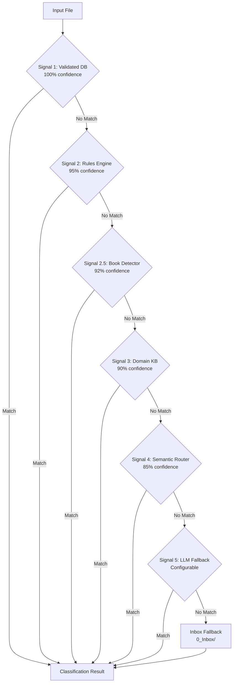
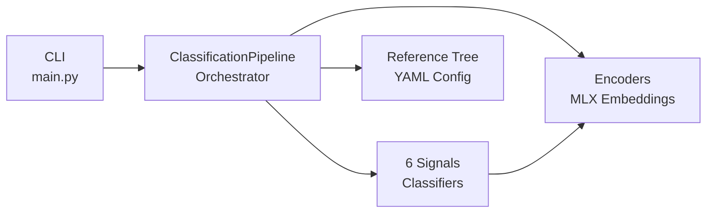

# Architecture Overview

Understanding how para-files classifies documents.

## The 6-Signal Pipeline

Para-files tries 6 classification signals in order. The first confident match wins.



## Signal Details

| Signal | Confidence | What It Does | When to Use |
|--------|-----------|-------------|------------|
| **1. Validated DB** | 100% | Uses manually approved mappings | After you've learned patterns |
| **2. Rules Engine** | 95% | Matches filename/path glob patterns | For filename-based routing |
| **2.5 Book Detector** | 92% | Detects technical books via ISBN/metadata | Automatic for PDFs |
| **3. Domain KB** | 90% | Matches known company/issuer | When you register issuers |
| **4. Semantic Router** | 85% | Embeddings match to utterances | Content-based matching |
| **5. LLM Fallback** | Variable | Asks AI model (optional) | When other signals unsure |

## How to Improve Matching

Choose based on your situation:

- **Low confidence matches** → Add utterances (Signal 4)
- **From known companies** → Register issuer (Signal 3)
- **Need highest accuracy** → Use learning (Signal 1)
- **Generic filenames** → Better content analysis needed

## Component Architecture



## Data Flow

```
File Input
    ↓
Extract Metadata (filename, content, dates)
    ↓
Try Signal 1 → 2 → 2.5 → 3 → 4 → 5
    ↓
Return Result (category + confidence + source)
    ↓
Action (classify, move, learn, etc.)
```

## Key Technologies

- **MLX Embeddings** - Local semantic matching on Apple Neural Engine
- **YAML Reference Tree** - Configuration of routes and utterances
- **Cosine Similarity** - Semantic matching algorithm
- **Optional LLM** - Qwen 2.5 via Ollama

## Next Steps

Learn about each signal:

- **[Signal 1: Validated DB](signal-1-validated-db.md)** - Manual mappings
- **[Signal 2: Rules Engine](signal-2-rules.md)** - Pattern matching
- **[Signal 3: Domain KB](signal-3-domain-kb.md)** - Known issuers
- **[Signal 4: Semantic Router](signal-4-semantic.md)** - ML embeddings
- **[Signal 5: LLM Fallback](signal-5-llm.md)** - Optional AI
